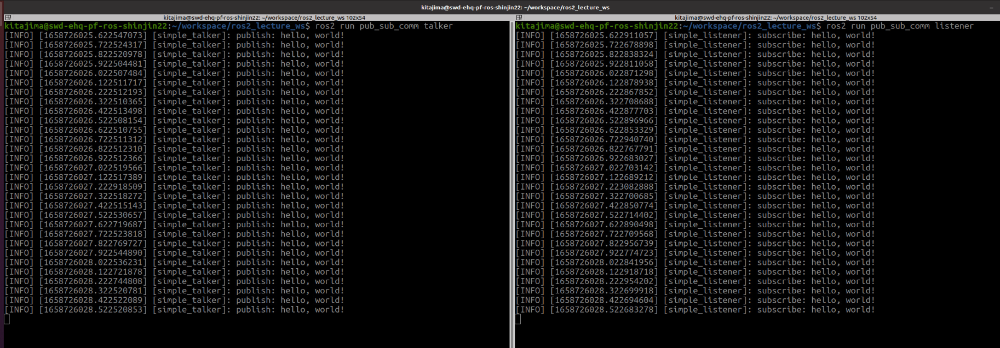

# 実習ROS 2 Pub&Sub通信

## 環境

本記事は以下の環境を想定して記述している。  
|項目|値|
|---|---|
|OS|Ubuntu 22.04|
|ROS|ROS 2 Humble|

## 概要

本記事では、ROS(ROS 1、ROS 2共通)の基本となる通信手段であるPub&Sub型通信（トピック通信）について説明し、ROS 2でこれを実装する。  
本記事の内容はROS 2公式チュートリアルをベースとしている。（[ROS 2公式チュートリアル](https://docs.ros.org/en/humble/Tutorials/Beginner-Client-Libraries/Writing-A-Simple-Cpp-Publisher-And-Subscriber.html)）

## 本記事で解説していること

- ROSのトピック通信（Pub&Sub通信）の概念
- 新規ROS 2パッケージの作成方法
- Publisherのソースコード(C++)
- Subscriberのソースコード(C++)
- Pub&Sub通信における、ROS 1とROS 2のコーディングの差異

## Pub&Sub通信

ROSはロボットアプリケーションを分散処理システムとして実現するための仕組みを持つ。プログラムはノードと呼ばれる処理単位に分けられ、それらの間のメッセージ通信によってアプリケーション全体の処理が実現される。  

ノード間のメッセージ通信手段の1つとして、トピック通信がある。トピックはデータの型と名前をもつ通信チャネルで、ノードがデータを送信、受信する対象である。  

以下にトピック通信の模式図を示す。  
図は、simple_talkerという名前のノードがメッセージを送信し、simple_listenerという名前のノードがメッセージを受信する様子を示している。  
chatterはトピックの名前で、トピックを送信することを「（メッセージを）publishする」、受信することを「subscribeする」という。  
このことから、トピック通信をPub&Sub通信ともいう。  
トピック通信では、メッセージを送受信するお互いのノードの存在を意識せずに処理を実装することができる。  

トピックには名前のほかに型があり、今回の実装では文字列を表す`std_msgs::msg::String`型のメッセージを用いる。  
ROS 2のデータ型としては、例えば以下が挙げられる。

- 64bit長の浮動小数点数を表す`std_msgs::msg::Float64`型
- 32bit長の符号あり整数型を表す`std_msgs::msg::Int32`型
- カメラ画像を表す`sensor_msgs::msg::Image`型
- パスを表す`nav_msgs::msg::Path`型


## 前準備

ROS 2のプログラムを作成し実行するまでに必要な前準備として、以下を行う必要がある。

- ROS 2のインストール
- ワークスペースの作成
- ROS 2パッケージの作成

ここでは、ROS 2のインストールは終了しており、ワークスペースは`~/ros2_lecture_ws`にあるという前提で説明する。  
パッケージは、以下のように作成したと仮定して説明する。

```sh
cd ~/ros2_lecture_ws/src
ros2 pkg create --build-type ament_cmake pub_sub_comm
```

上記のコマンドでは、ament_cmakeというビルドシステムを使用した`pub_sub_comm`という名前のパッケージを作成している。

## ソースファイルの作成

Pub&Sub通信を行うシンプルなROS 2プログラムを作成するために、以下の4つを行う。

- Publisherのコーディング
- Subscriberのコーディング
- 依存関係の設定
- CMakeLists.txtの設定

ソースファイルの作成は以下のコマンドで行う。

```bash
cd ~/ros2_lecture_ws/src/pub_sub_comm
touch src/simple_talker.cpp src/simple_listener.cpp
```

### Publisherのコーディング

以下のリンク先のソースコードを実装する。

[simple_talker.cpp](https://github.com/esol-community/ros2_lecture/tree/main/beginner/pub_sub_comm/src/simple_talker.cpp)

ここでは、publisherを以下のように`SimpleTalker`クラスのメンバ変数として宣言している。

```cpp
// rclcpp::Nodeを継承したクラスSimpleTalkerの宣言
class SimpleTalker : public rclcpp::Node
{
  // （省略）

private:
  // std_msgs::msg::String型のトピックを送信するpublisher
  rclcpp::Publisher<std_msgs::msg::String>::SharedPtr publisher_;
};
```

publisherは、`rclcpp::Node`クラスが持つ関数`create_publisher()`によって作成されている。

```cpp
  // （省略）

  // コンストラクタ
  SimpleTalker()
  : Node("simple_talker")   // ノード名をsimple_talkerで初期化
  {
    // publisherの生成
    // 第一引数はトピック名、第二引数はバッファサイズ
    publisher_ = this->create_publisher<std_msgs::msg::String>("chatter", 10);

    // （省略）
  }

  // （省略）
```

ROS 1のチュートリアルのpublisherでは定期的な処理をwhileループでコーディングしていた。  
一方ROS 2では、定期的な処理をタイマとコールバック関数で実装する。  
タイマは`rclcpp::spin()`関数を実行すると開始される。

### Subscriberのコーディング

以下のリンク先のソースコードを実装する。

[simple_listener.cpp](https://github.com/esol-community/ros2_lecture/tree/main/beginner/pub_sub_comm/src/simple_listener.cpp)

ここでは、subscriberを以下のように`SimpleListener`クラスのメンバ変数として宣言している。

```cpp
// rclcpp::Nodeを継承したクラスSimpleListenerの宣言
class SimpleListener : public rclcpp::Node
{
  // （省略）

private:
  // （省略）

  // std_msgs::msg::String型のトピックを受信するsubscriber
  rclcpp::Subscription<std_msgs::msg::String>::SharedPtr subscription_;
};
```

subscriberは、publisherと同様に`rclcpp::Node`クラスが持つ関数`create_subscription()`によって作成されている。

```cpp
  // （省略）

  // コンストラクタ
  SimpleListener()
  : Node("simple_listener")   // ノード名をsimple_listenerで初期化
  {
    // subscriberの作成
    // 第一引数はトピック名
    // 第二引数はメッセージのバッファサイズ、
    // 第三引数は受信したときに呼ばれる関数
    subscription_ = this->create_subscription<std_msgs::msg::String>(
      "chatter", 10, std::bind(&SimpleListener::chatter_callback, this, _1)
    );
  }

  // （省略）
```

### 依存関係の設定

パッケージを作成すると`package.xml`というファイルが自動で生成される。このファイルにはパッケージ全体のメタデータを記述する。  
package.xmlの全体像は[こちら](https://github.com/esol-community/ros2_lecture/tree/main/beginner/pub_sub_comm/package.xml)。（ただし、リンク先のファイルには以降の講座で追記する内容も含まれている。コピペした場合、この記事では不要な依存関係を記載することになる）  

以下、自動生成されたファイルから変更した部分を説明する。

- バージョン（version）、パッケージの説明（description）、メンテナー（maintainer）、ライセンス情報（license）を記述する。  
  なお、今回実装するソースコードはBSD-2-Clauseライセンスであるため以下のように記述したが、ROS 2そのものはApache License 2.0で開発されている。

```xml
<version>0.0.1</version>
<description>Examples of minimal publisher/subscriber using rclcpp</description>
<maintainer email="maintainer@example.com">Maintainer Name</maintainer>
<license>2-Clause BSD License</license>
```

- このパッケージが依存しているパッケージを依存関係（depend）として記述する。ここでは、rclcppパッケージとstd_msgsパッケージを指定する。

```xml
<depend>rclcpp</depend>
<depend>std_msgs</depend>
```

### CMakeLists.txtの設定

パッケージを作成するときに`--build-type ament_cmake`というオプションを指定すると`CMakeLists.txt`というファイルが自動で生成される。このファイルにはCMakeでのビルド設定を記述する。  
CMakeLists.txtの全体像は[こちら](https://github.com/esol-community/ros2_lecture/tree/main/beginner/pub_sub_comm/CMakeLists.txt)。（ただし、リンク先のファイルには以降の講座で追記する内容も含まれているため、コピペするとエラーが発生する）  

以下、追記した部分について説明する。

- `find_package()`ではこのROS 2パッケージが依存するパッケージ名を書く。

```cmake
find_package(rclcpp REQUIRED)
find_package(std_msgs REQUIRED)
```

- `add_executable()`では実行ファイル生成の設定を書く。第一引数が実行ファイル名（自由に付けられる）で、第二引数にソースファイルを書く。
- `ament_target_dependencies()`では、ライブラリの依存関係を書く。

```cmake
add_executable(talker src/simple_talker.cpp)
ament_target_dependencies(talker rclcpp std_msgs)
```

```cmake
add_executable(listener src/simple_listener.cpp)
ament_target_dependencies(listener rclcpp std_msgs)
```

- `install()`では、インストール用の設定を書く。インストールするターゲット名と、その場所を書く。

```cmake
install(TARGETS
  talker
  listener
  DESTINATION lib/${PROJECT_NAME})
```

## ビルド

```bash
cd ~/ros2_lecture_ws
colcon build --packages-select pub_sub_comm
```

ワークスペースで`colcon build`コマンドを実行するとプログラムをビルドできる。`--packages-select`オプションによって、ビルドするパッケージを選ぶことができる。コンパイルエラーがある場合はここで表示される。

## 実行

ROS 2では、ROS 1と異なり、roscoreを起動させる必要がない。そのため、simple_talkerを実行するターミナルと、simple_listenerを実行するターミナルの2つで実行が可能である。

- 1つ目のターミナルで実行

```bash
cd ~/ros2_lecture_ws              # ワークスペースへの移動
. install/setup.bash              # ワークスペース環境のセットアップ
ros2 run pub_sub_comm listener    # 実行
```

- 2つ目のターミナルで実行

```bash
cd ~/ros2_lecture_ws
. install/setup.bash
ros2 run pub_sub_comm talker
```

## 結果

simple_talkerを実行させたターミナルからはメッセージをpublishしている表示が現れる。それと同時にsimple_listenerを実行させたターミナルからsubscribeしているメッセージが表示される。これにより`/chatter`トピックが正しく送受信できていることが確認できる。



## ROS 1とROS 2の違い

ROS 1とROS 2におけるPub&Sub通信の実装、実行方法の大きな違いを以下にまとめる。

- ROS 1ではマスタノードroscoreを起動させる必要があるのに対し、ROS 2ではその必要がない。
- ROS 1では定期的な処理をwhileループで実装することが多いが、ROS 2ではタイマとそのコールバック関数で実現する。  
  （なお、ROS 1でもタイマコールバックによる定期処理は可能である。）
- ROS 1ではメッセージ型が`std_msgs::String`であるが、ROS 2では`std_msgs::msg::String`である。

## 参考

- [ROS 2公式チュートリアル：Writing a simple publisher and subscriber (C++)](https://docs.ros.org/en/humble/Tutorials/Beginner-Client-Libraries/Writing-A-Simple-Cpp-Publisher-And-Subscriber.html)
- [ROS講座03 Pub & Sub 通信](https://qiita.com/srs/items/26ca826802d07a9e3d4e)
