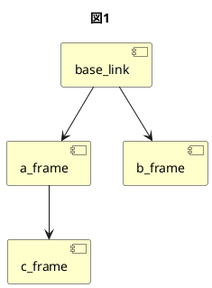

# 実習ROS 2 tf2 broadcaster, listen

## 環境

本記事は以下の環境を想定して記述している。  

| 項目 | 値                   |
| ---- | -------------------- |
| OS   | Ubuntu 22.04         |
| ROS  | ROS 2 Humble         |

## 本記事の概要

本記事では、tf2の概要とbroadcaster, listenerの作成方法について解説する。  
本記事の内容は、[ROS講座17 tf-2broadcast、listen](https://qiita.com/srs/items/bff3cc40be352973a8aa)
の内容を[ROS 2公式チュートリアル：tf2](https://docs.ros.org/en/humble/Tutorials/Intermediate/Tf2/Tf2-Main.html#)を参考にしてROS 2対応させたものである。

## tf2について

tf2とはロボットの座標変換ライブラリの名称である。  
tf2では各座標系をフレームと呼び、このフレーム同士の関係をツリー構造で管理する。  
また、2つのフレーム間の位置と姿勢を追跡でき、時間の管理も可能である。  

### ツリー構造について

フレームは親子関係を持つ事ができ、原点となるフレームを親、
そこから派生するフレームを子として扱う。  

例えば、以下のようなフレームがあるとする。

- 原点となるフレーム`base_link`
- `base_link`を親とするフレーム`a_frame`
- `base_link`を親とするフレーム`b_frame`
- `a_frame`を親とするフレーム`c_frame`

上記をツリー構造で可視化すると以下のようになる。



このようにtf2では各フレームがツリー構造で示される。

### フレームの変換について

座標はその物の位置を示すが、どこを原点とするかによってその位置情報に差が生まれる。  
先ほどの例を用いて説明すると、原点が`bese_link`の場合と`b_frame`の場合では`a_frame`の位置情報が異なる。  
この差の変換を容易に行えるようにしたのがtf2である。  

### 時間について

時間を記録することで、どの座標がどの時間にどこにいたかを認識できるようになる。  
例えば、`a_frame`が5秒前にいた位置を認識し`c_frame`を移動させることが可能になる。

### 補足1：tfとtf2  

tf2はtfというライブラリをさらに改善したものである。  
ROS 1ではtfとtf2の二つのライブラリがあり、ROS Hydro以降はtf2が推奨されていた。(参考：[http://wiki.ros.org/tf])  
ROS 2では使用ライブラリはtf2に統一されている。  

### 補足2：tfの概要について

tfの概要については、以下のサイトでも解説されているため合わせて確認するとよい。  

- [ROS講座15 tf-1:概要](https://qiita.com/srs/items/6044686a2a734f7c4c50)

## tf2のbroadcast

broadcastとは以下の情報を`/tf` or `/tf_static`トピックに送信することである。

- 親フレーム(parent)のフレーム名
- 子フレーム(child)のフレーム名
- 親フレームから見た子フレームの位置と姿勢情報
- この関係が存在した時間

broadcasterには以下の2種類がある。

- static
  - 親フレームと子フレームの位置関係が常に同じであるもの。
  - `/tf_static`に情報が配信される。
  - 常に関係性が同じであるため、broadcastを行うのはノード起動時の一回のみである。
- dynamic
  - 親フレームと子フレームの位置関係が時間によって異なるもの。
    - 例えば、親フレームが地図・子フレームが走行している車だった場合、位置関係が時間によって変わるためdynamicとなる。
  - `/tf`に情報が配信される。
  - 位置関係や時間が変わるため、正しい情報を得るために常にbroadcastする必要がある。

## tf2のlisten

listenはbroadcastされた`/tf` もしくは `/tf_static`を受信してその情報を保持する。  
保持時間は標準で最大10秒間である。  
ここで得た情報を用いて座標変換結果の取得を行える。

## ソースコード作成

実際にbroadcasterとlistenerを作成する。

### パッケージの作成

まず初めにパッケージの作成を行う。  
ワークスペースは[Pub&Sub通信](https://qiita.com/s-kitajima/items/5a4d7f06413120010e6b)等に使用した`ros2_lecture_ws`を今回も使用する。  
パッケージ作成は以下のようにして行う。

```shell
cd ~/ros2_lecture_ws/src
ros2 pkg create --build-type ament_cmake tf2_lecture
```

### broadcasterの実装

broadcasterを実装する。ソースコードへのリンクは[こちら](https://github.com/esol-community/ros2_lecture/tree/main/beginner/ros2_tf2_broadcaster_listen/./tf2_lecture/src/tf2_broadcaster.cpp)。

このコードでは、親フレームを`base_link`とし、子フレームとして以下二つを作成している。

- staticなフレームである`static_frame`
  - `base_link`からz軸の正方向に1.0離れた位置で静止している。
  - ノード起動時に一度だけbroadcastされる。
- dynamicなフレームである`dynamic_frame`
  - `base_link`の周りを周回する。
  - 1秒おきにbroadcastされる。

コードの細かい解説についてはコード内のコメントを参照することとし、コメントで扱いきれなかった情報について以下にまとめる。  

- 姿勢の設定には四元数が使用されている。  
  四元数とは、姿勢を表すための表現方法である。
  - 四元数については、以下のサイトが参考になる
    - [ROS 2公式チュートリアル：Quaternion-Fundamentals](https://docs.ros.org/en/humble/Tutorials/Intermediate/Tf2/Quaternion-Fundamentals.html)

### listenerの実装

listenerを実装する。ソースコードへのリンクは[こちら](https://github.com/esol-community/ros2_lecture/tree/main/beginner/ros2_tf2_broadcaster_listen/./tf2_lecture/src/tf2_listener.cpp)

このコードでは、broadcastされたデータを受け取り`base_link`から`dynamic_frame`への変換情報を出力している。

- lookupTransform()関数で2つのフレーム間の変換結果を取得する。
  - この関数からは、`source frame`における座標を`target frame`に変換するための座標変換が得られる。  
  - 変換は、第二引数の`source frame`から第一引数の`target frame`へと行われる。  
  - 第三引数には時刻を指定するが、基本的には`tf2::TimePointZero`を使えばよい。(※1)
- 座標変換が正常に行われなかった場合lookupTransform()関数は例外を出すため、座標変換をする際は必ずtry-catch構文による例外処理を使用する。

※1  
`tf2::TimePointZero`を使うことで変換可能な最新の時刻を設定できるが、他の時間を指定することもできる。  
本記事では説明を省略するが、下記サイトが参考になる。

- [ROS 2公式チュートリアル：tf2](https://docs.ros.org/en/humble/Tutorials/Intermediate/Tf2/Tf2-Main.html#)
  - [Using time](https://docs.ros.org/en/humble/Tutorials/Intermediate/Tf2/Learning-About-Tf2-And-Time-Cpp.html)
  - [Traveling in time](https://docs.ros.org/en/humble/Tutorials/Intermediate/Tf2/Time-Travel-With-Tf2-Cpp.html)

## ビルドの設定

以下、launchファイルとビルドの設定を行う。

### launch

各フレームを可視化するため、今回はbroadcaster, listenerの実行に加え、RVizも同時に実行させる。  
よって、上記3つのノードを同時起動できるlaunchファイルを作成する。  
ソースコードは[こちら](https://github.com/esol-community/ros2_lecture/tree/main/beginner/ros2_tf2_broadcaster_listen/./tf2_lecture/launch/tf2_lecture.launch.py)

### CMakeLists.txt

tf2_lecture/CMakeLists.txtに以下を追記する。

```diff
+find_package(ament_cmake REQUIRED)
+find_package(geometry_msgs REQUIRED)
+find_package(rclcpp REQUIRED)
+find_package(tf2 REQUIRED)  # tf2の使用のために必要
+find_package(tf2_ros REQUIRED)　# tf2の使用のために必要

+add_executable(tf2_broadcaster
+  src/tf2_broadcaster.cpp
+)
+add_executable(tf2_listener
+  src/tf2_listener.cpp
+)

+ament_target_dependencies(tf2_broadcaster
+  geometry_msgs
+  rclcpp
+  tf2
+  tf2_ros
+)
+ament_target_dependencies(tf2_listener
+  geometry_msgs
+  rclcpp
+  tf2
+  tf2_ros
+)

+install(TARGETS
+  tf2_broadcaster
+  tf2_listener
+  DESTINATION lib/${PROJECT_NAME}
+)
+install(
+  DIRECTORY
+  launch
+  DESTINATION share/${PROJECT_NAME}/
+)
```

### package.xml

tf2_lecture/package.xmlに以下を追記する。

```diff
+  <depend>geometry_msgs</depend>
+  <depend>rclcpp</depend>
+  <depend>tf2</depend>
+  <depend>tf2_ros</depend>

+  <exec_depend>ros2launch</exec_depend>
```

### ビルド

以下のコマンドでビルドを行う。  

```shell
colcon build --packages-select tf2_lecture 
```

なお、ビルドを行う前に下記コマンドで不足している依存関係がないか確認するとよい。  

```shell
rosdep install -i --from-path src --rosdistro humble -y
```

## 実行と確認

ビルドが終われば、以下のコマンドを実行してlaunchファイルを起動する。  
なお、ros2_lecture_wsで`. install/setup.bash`コマンドを実行していないと起動できないので注意。  

```shell
ros2 launch tf2_lecture tf2_lecture.launch.py 
```

実行後、ターミナルに`base_link`から`dynamic_frame`への座標変換結果が以下のように出力される。

```shell
[tf2_listener-3] [INFO] [1674105583.846797874] [listener1]: base_link->dynamic_frame: -0.714269 0.699871 0.000000
[tf2_listener-3] [INFO] [1674105584.846805414] [listener1]: base_link->dynamic_frame: 0.714264 -0.699876 0.000000
[tf2_listener-3] [INFO] [1674105585.846810339] [listener1]: base_link->dynamic_frame: -0.714236 0.699904 0.000000
(以下省略)
```

ただし、RVizが初期設定のままだと何も表示されないので下記に示す設定を行う必要がある。

### RVizの設定

以下、今回作ったフレームをRViz上で可視化させるための操作手順である。  
なお、`rviz2`でRVizを起動しモニター上にRVizが起動されている前提とする。  

1. "Add"ボタン(RViz画面左下にある)を押す。  
2. 新しくウィンドウが表示されるので、"By display type"タブから`TF`という項目を探してクリックし右下の"✓OK"ボタンを押す。  
   - これによって、tf関係のトピックが可視化される。  
3. "Displays"タブの中にある"Fixed Frame"で`map`が選択されている場合、`base_link`に変更する。  
   - `map`をクリックして右の▼ボタンをクリックすると選択できるフレームのリストが表示されるので、そこから選ぶ。  
     - ここで選択したフレームが原点となり、そのフレームに基づく各座標が可視化されるようになる。  
     - `map`というフレームは今回使用していないため、親フレームである`base_link`に変更している。  
4. "TF"横にある▶ボタンを押して"Shown Names"にチェックを入れる。  
   - これにより各フレームの名前を表示できる。  

以上の操作を行うと下記のような画面になる。  


以下のような表示がなされていることが期待動作である。

- `base_link`, `static_frame`, `dynamic_frame`の三つの座標が見える。
- `static_frame`が静止している。
- `dynamic_frame`が、`base_link`の周りを一定の距離/速さで移動している。

## 参考

- [ROS 2公式チュートリアル：tf2](https://docs.ros.org/en/humble/Tutorials/Intermediate/Tf2/Tf2-Main.html#)
  - [Writing a broadcaster(C++)](https://docs.ros.org/en/humble/Tutorials/Intermediate/Tf2/Writing-A-Tf2-Broadcaster-Cpp.html)
  - [Writing a listener(C++)](https://docs.ros.org/en/humble/Tutorials/Intermediate/Tf2/Writing-A-Tf2-Listener-Cpp.html)
  - [Adding a frame](https://docs.ros.org/en/humble/Tutorials/Intermediate/Tf2/Adding-A-Frame-Cpp.html)
  - [Using time](https://docs.ros.org/en/humble/Tutorials/Intermediate/Tf2/Learning-About-Tf2-And-Time-Cpp.html)
- [ROS講座15 tf-1:概要](https://qiita.com/srs/items/6044686a2a734f7c4c50)
- [ROS講座17 tf-2broadcast、listen](https://qiita.com/srs/items/bff3cc40be352973a8aa)
